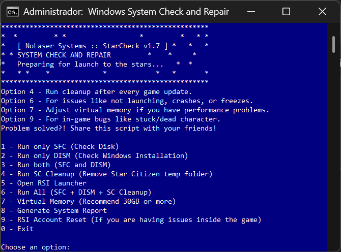

# StarCheck

## Download — StarCheck v1.8 (EXE)

**Get the latest binary:** [Download StarCheck.exe (v1.8)](https://github.com/appocalypsebr/StarCheck/releases)

Download the executable and run it as Administrator. The release page contains SHA256 checksums and additional assets.  

**[PT] Ferramenta gratuita para diagnóstico e otimização do Windows, com foco em desempenho para Star Citizen.**  
**[EN] Free tool for diagnosing and optimizing Windows systems, focused on Star Citizen performance.**

Scripts automatizados e binário interativo para verificar, analisar e otimizar seu sistema com facilidade.  
Automated scripts and an interactive binary to check, analyze and tune your system with ease.

---

## Modos de Execução | Execution Modes

StarCheck oferece duas formas de uso:  
StarCheck offers two ways to use:

### 1. Scripts `.BAT`

- Automação SC BR.bat — [PT] Português  
- Automation SC EN.bat — [EN] English

**Funcionalidades | Features:**

- Diagnóstico com SFC e DISM | System diagnostics with SFC and DISM  
- Ajustes para Star Citizen (ex.: Resizable BAR, etc)  
- Limpeza de dados e otimizações | Cache cleanup and optimizations  
- Interface em modo texto com instruções claras | Text-based interface with clear instructions

---

### 2. Executável `.EXE` Interativo | Interactive `.EXE` Binary

Agora disponível como binário compilado, o `StarCheck.exe` oferece uma interface com perguntas e respostas.  
Now available as a compiled binary, `StarCheck.exe` provides a terminal-based Q&A interface.

#### Perguntas Frequentes | Frequently Asked Questions

**O que é o StarCheck.exe?**  
Um aplicativo de terminal que guia o usuário por meio de perguntas.  
**What is StarCheck.exe?**  
A terminal app that guides users through questions.

**Benefícios | Benefits:**

- Interface interativa | Interactive interface  
- Evita erros acidentais | Prevents accidental misuse  
- Ideal para iniciantes | Great for beginners  
- Mesmas funções dos `.bat` | Same features as `.bat` scripts

**Como usar | How to use:**

1. Baixe em [Releases](https://github.com/appocalypsebr/StarCheck/releases)  
2. Execute como administrador | Run as administrator  
3. Responda às perguntas | Answer the questions  
4. O programa aplicará os ajustes | The program will apply the selected actions

**Permissões de administrador?** Sim.  
**Admin permissions?** Yes.

**Posso continuar usando os `.bat`?** Claro!  
**Can I still use `.bat` files?** Absolutely!

---

## Imagens | Screenshots

**[EN] English Version:**  

**[PT] Versão em Português:**  

---

## Como Começar | Getting Started

1. Clone ou baixe este repositório | Clone or download this repository  
2. Escolha `.bat` ou `.exe` | Choose `.bat` or `.exe`  
3. Execute como administrador | Run as administrator  
4. Siga as instruções | Follow the instructions

---

## Contribua | Contribute

Quer adicionar outro idioma ou melhorar os scripts?  
Want to add another language or improve the scripts?

Copie um `.bat`, traduza e envie um pull request.  
Copy a `.bat`, translate it, and submit a pull request.

---

## Licença | License

Distribuído sob a Licença MIT — livre para usar, modificar e compartilhar.  
Distributed under the MIT License — free to use, modify, and share.